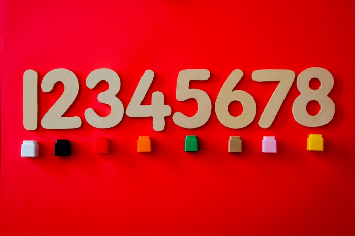

The `area of discussion` will get even wider as we will get familiarize with various domains of programming like :

* Software application developer.
* Web developer.
* Computer systems engineer.
* Database administrator.
* Computer systems analyst.
* Software quality assurance (QA) engineer.
* Business intelligence analyst.
* Computer programmer.
* Network System Administrator

### “Everything we see around you is nothing but a bunch of codes written by various developers”

You don’t have to decide what you’re going to do with your skills before you develop them, although some pathways will lead more easily to others, as we’ll see going forward.

--- 

## Start With The Fundamentals

 
 

Some core principles exist in every programming language or role. Logic, flow-control, comparisons, variables, data structures, and more are universal concepts you will need to know and understand in any coding context.

The good thing is, you don’t have to study these basics every time you start with a new programming language. As mentioned before, these core concepts are universal and are applied with few syntactical variations in different languages.

---

## Do What Excites You

 
 

Once you get familiar with the basic idea and working, now it’s time for you to start exploring. Go through various options that you can opt for. You need to ask yourself: `“What excites me about coding?”` Look around you, scroll through the internet, and see what is the thing which you would love to do.

### Initial Preparation

Now that you know what you like, it’s time for building the initial favorable environment for your plan!

#### Lights! Cameras! Code!

Start learning the `basic programming language` that would be essential for your project. Make sure that you go through every concept in `depth`; otherwise, you could face problems further down the road.

Once you are well equipped with the language basics, start `developing a mindset`, and get familiarized with all the skills and abilities that you should develop to be a great developer of your domain. This can be achieved by following the various `blog, listening podcasts, and getting connected to individuals who are already in that domain`.

---

## Building Projects

 
 

Now it’s time for you to get ready for the next level: `building projects`. You may feel that you aren’t ready yet, and this could be a scary step, but pick `something small and start working on it!`

Your first project does not need to be industry-ready or professional. It can be pretty inconsequential and simple. Remember that `nothing feels better than seeing your first project all the way through completion`.

It’s so nice when we are learning and start to feel confident. This is a great time to enjoy being `“in the flow”` and keep learning and building. When you start learning something new, you need a `lot of persistence` to keep your learning consistent!

---

## Errors and Mentorship

 
 

One of the most essential skills that a programmer develops is his/her journey is debugging skills. In my initial years of Programming, I used to hate errors. In the past, I have had a mindset that having no errors on the go is the best way to operate but I was wrong. In the course of the last few years, I realized that `encountering errors and resolving them was the most important part of my journey.`

### “The more errors you encounter, the better you get”

This can be an intimidating step for many, but I promise you, very few things will help move you along faster than a good mentor.
Your mentor doesn’t have to be someone local. With peer-programming built into many coding applications now, you can find someone online in a `web forum, Stack Overflow, a Facebook group, Twitter, etc,` and ask them to take just a bit of time once a week to help you understand something that’s stumping you.

A `mentor` can be that shortcut you need to keep your momentum moving forward!

---

## Some Useful Resources (Good websites, articles & videos):

 
 

### Websites
* `freeCodeCamp` is a great website focused on web development and JavaScript. Totally free (YEY!).

* `Udemy`, `CodeSchool`, and `Khan Academy` are very similar in terms of varieties of courses, but Udemy has paid courses, Khan Academy is free, and CodeSchool is a mix of both (paid and free courses).

* Don’t forget the MOOC’s: `Udacity`, `Coursera`, and `edX`. All these websites have great courses. Give it a try! :)

## Follow people on Twitter

* If you are interested in Machine Learning, Andrew Ng is the person!

* For programming stuff, I like to read tweets from DHH (Ruby on Rails creator), Dan Abramov (Redux Co-author), Tracy Chou (former Quora, Pinterest), Quincy Larson (freeCodeCamp creator), Preethi Kasireddy (Blockchain Engineer), Dan Bader (runs Real Python), and the list goes on.

## People who are documenting their journey on Medium

* How To Successfully Teach Yourself How To Code by `Lydia Hallie`

* How I went from fashion model to software 
engineer in 1 year by `Madison Kanna`

* BaseCS by `Vaidehi Joshi`

* Here’s Why Learning How To Code Is So Hard by `Kevin Kononenko`

* I Want to Learn Programming but I Don’t Know where to Start by `Robyn Silber`

## Vlogs & YouTube channels

I really like to watch vlogs and see people’s lifestyles on YouTube.

* `Fun Fun Function` is a channel run by Mattias Petter Johansson, a former Spotify Engineer. It started with JavaScript, but lately, he is talking about development in general. I really like how he puts his ideas and present each topic.

* `Mayuko` is an iOS software engineer working at Patreon. She also talks about engineering and lifestyle in general.

* `CS Dojo` is really focused on programming interview advice, algorithms and data structure stuff. This channel is from YK Sugishita, a former Google Engineer in Canada.

* `Joma Tech` is the funniest and more entertaining YouTube channel among all. Jonathan Ma is a data scientist at Facebook. He vlogs about his engineer life and also gives coding interview advice based on his experience interning in a bunch of tech companies.

---

## That’s all!

I hope this article can help you get started. Have fun! Keep learning and coding.

### Happy Learning!

Link to published article: [`Medium`](https://codeburst.io/how-to-get-started-with-coding-9a18f8e2af4)