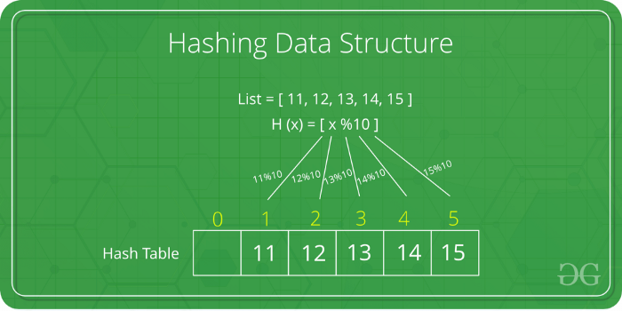

## Introduction :

Hashing is an important Data Structure which is designed to use a special function called the Hash function which is used to map a given value with a particular key for faster access of elements. The efficiency of mapping depends of the efficiency of the hash function used.

Let a hash function H(x) maps the value


at the index x%10 in an Array. For example if the list of values is [11,12,13,14,15] it will be stored at positions {1,2,3,4,5} in the array or Hash table respectively.



<br/>


---
<br/>

## Phase-1 Learning

### Suppose we want to design a system for storing employee records keyed using phone numbers. And we want following queries to be performed efficiently:

* Insert a phone number and corresponding information.
* Search a phone number and fetch the information.
* Delete a phone number and related information.

We can think of using the following data structures to maintain information about different phone numbers.

* Array of phone numbers and records.
* Linked List of phone numbers and records.
* Balanced binary search tree with phone numbers as keys.
* Direct Access Table.


For `arrays and linked lists`, we need to search in a linear fashion, which can be costly in practice. If we use arrays and keep the data sorted, then a phone number can be searched in O(Logn) time using Binary Search, but insert and delete operations become costly as we have to maintain sorted order.

With `balanced binary search tree`, we get moderate search, insert and delete times. All of these operations can be guaranteed to be in O(Logn) time.

Another solution that one can think of is to use a   where we make a big array and use phone numbers as index in the array. An entry in array is NIL if phone number is not present, else the array entry stores pointer to records corresponding to phone number. Time complexity wise this solution is the best among all, we can do all operations in O(1) time. For example to insert a phone number, we create a record with details of given phone number, use phone number as index and store the pointer to the created record in table.

This solution has many practical limitations. First problem with this solution is extra space required is huge. For example if phone number is n digits, we need ``O(m * 10n)`` space for table where m is size of a pointer to record. Another problem is an integer in a programming language may not store n digits.

Due to above limitations Direct Access Table cannot always be used. `Hashing` is the solution that can be used in almost all such situations and performs extremely well compared to above data structures like Array, Linked List, Balanced BST in practice. With hashing we get O(1) search time on average (under reasonable assumptions) and O(n) in worst case.

*Hashing is an improvement over Direct Access Table. The idea is to use hash function that converts a given phone number or any other key to a smaller number and uses the small number as index in a table called hash table.*

`Hash Function`: A function that converts a given big phone number to a small practical integer value. The mapped integer value is used as an index in hash table. In simple terms, a hash function maps a big number or string to a small integer that can be used as index in hash table.

A good hash function should have following properties
1) Efficiently computable.
2) Should uniformly distribute the keys (Each table position equally likely for each key)

For example for phone numbers a bad hash function is to take first three digits. A better function is consider last three digits. Please note that this may not be the best hash function. There may be better ways.

`Hash Table`: An array that stores pointers to records corresponding to a given phone number. An entry in hash table is NIL if no existing phone number has hash function value equal to the index for the entry.

`Collision Handling`: Since a hash function gets us a small number for a big key, there is possibility that two keys result in same value. The situation where a newly inserted key maps to an already occupied slot in hash table is called collision and must be handled using some collision handling technique. Following are the ways to handle collisions:

* `Chaining`:The idea is to make each cell of hash table point to a linked list of records that have same hash function value. Chaining is simple, but requires additional memory outside the table.
* `Open Addressing`: In open addressing, all elements are stored in the hash table itself. Each table entry contains either a record or NIL. When searching for an element, we one by one examine table slots until the desired element is found or it is clear that the element is not in the table.

---

## Phase-2 Learning

### What is Collision?
Since a hash function gets us a small number for a key which is a big integer or string, there is a possibility that two keys result in the same value. The situation where a newly inserted key maps to an already occupied slot in the hash table is called collision and must be handled using some collision handling technique.

### What are the chances of collisions with large table?
Collisions are very likely even if we have big table to store keys. An important observation is Birthday Paradox. With only 23 persons, the probability that two people have the same birthday is 50%.

### How to handle Collisions?
There are mainly two methods to handle collision:
1) Separate Chaining
2) Open Addressing
In this article, only separate chaining is discussed. We will be discussing Open addressing in the next post.

### Separate Chaining:
The idea is to make each cell of hash table point to a linked list of records that have same hash function value.

Let us consider a simple hash function as **“key mod 7”** and sequence of keys as 50, 700, 76, 85, 92, 73, 101.


<br/>
<br/>

### Advantages:
1) Simple to implement.
2) Hash table never fills up, we can always add more elements to the chain.
3) Less sensitive to the hash function or load factors.
4) It is mostly used when it is unknown how many and how frequently keys may be inserted or deleted.
### Disadvantages:
1) Cache performance of chaining is not good as keys are stored using a linked list. Open addressing provides better cache performance as everything is stored in the same table.
2) Wastage of Space (Some Parts of hash table are never used)
3) If the chain becomes long, then search time can become O(n) in the worst case.
4) Uses extra space for links.

### Performance of Chaining:
Performance of hashing can be evaluated under the assumption that each key is equally likely to be hashed to any slot of table (simple uniform hashing).

```
m = Number of slots in hash table
 n = Number of keys to be inserted in hash table
 
 Load factor α = n/m 
  
 Expected time to search = O(1 + α)
 
 Expected time to insert/delete = O(1 + α)
 Time complexity of search insert and delete is 
 O(1) if  α is O(1)
```

---

## Phase-3 Learning

## Open Addressing
Like separate chaining, open addressing is a method for handling collisions. In Open Addressing, all elements are stored in the hash table itself. So at any point, size of the table must be greater than or equal to the total number of keys (Note that we can increase table size by copying old data if needed).
`Insert(k):` Keep probing until an empty slot is found. Once an empty slot is found, insert k.
`Search(k):` Keep probing until slot’s key doesn’t become equal to k or an empty slot is reached.
`Delete(k):` Delete operation is interesting. If we simply delete a key, then search may fail. So slots of deleted keys are marked specially as “deleted”.
Insert can insert an item in a deleted slot, but the search doesn’t stop at a deleted slot.

Open Addressing is done following ways:

`a) Linear Probing:` In linear probing, we linearly probe for next slot. For example, typical gap between two probes is 1 as taken in below example also.
let *hash(x)* be the slot index computed using hash function and S be the table size

```
If slot hash(x) % S is full, then we try (hash(x) + 1) % S
If (hash(x) + 1) % S is also full, then we try (hash(x) + 2) % S
If (hash(x) + 2) % S is also full, then we try (hash(x) + 3) % S 
..................................................
..................................................

```

Let us consider a simple hash function as “key mod 7” and sequence of keys as 50, 700, 76, 85, 92, 73, 101.


<br/>
<br/>


**Clustering: **The main problem with linear probing is clustering, many consecutive elements form groups and it starts taking time to find a free slot or to search an element.

b) `Quadratic Probing` We look for i2‘th slot in i’th iteration.

```
let hash(x) be the slot index computed using hash function.  
If slot hash(x) % S is full, then we try (hash(x) + 1*1) % S
If (hash(x) + 1*1) % S is also full, then we try (hash(x) + 2*2) % S
If (hash(x) + 2*2) % S is also full, then we try (hash(x) + 3*3) % S
..................................................
..................................................

```

c) `Double Hashing` We use another hash function hash2(x) and look for i*hash2(x) slot in i’th rotation.

```
let hash(x) be the slot index computed using hash function.  
If slot hash(x) % S is full, then we try (hash(x) + 1*hash2(x)) % S
If (hash(x) + 1*hash2(x)) % S is also full, then we try (hash(x) + 2*hash2(x)) % S
If (hash(x) + 2*hash2(x)) % S is also full, then we try (hash(x) + 3*hash2(x)) % S
..................................................
..................................................

```

### Comparison of above three:
Linear probing has the best cache performance but suffers from clustering. One more advantage of Linear probing is easy to compute.
Quadratic probing lies between the two in terms of cache performance and clustering.
Double hashing has poor cache performance but no clustering. Double hashing requires more computation time as two hash functions need to be computed.


## Performance of Open Addressing:
Like Chaining, the performance of hashing can be evaluated under the assumption that each key is equally likely to be hashed to any slot of the table (simple uniform hashing)

```
m = Number of slots in the hash table
 n = Number of keys to be inserted in the hash table
 
 Load factor α = n/m  ( < 1 )
 Expected time to search/insert/delete < 1/(1 - α) 
 So Search, Insert and Delete take (1/(1 - α)) time
```

Ref : https://www.geeksforgeeks.org/
Please let me know if anything was unclear, or if there’s anything else you’d like to see in this or a subsequent article. Feel free to reach out to me anytime if you want to discuss something. I would be more than happy if you send your feedback, suggestions.


### Thanks a lot for reading till end. You can contact me in case if you need any assistance:

**Web:** https://portfolio.abhisheksrivastava.me/

**Instagram:** https://www.instagram.com/theprogrammedenthusiast/

**LinkedIn:** https://www.linkedin.com/in/abhishek-srivastava-49482a190/

**Github:** https://github.com/abhishek2x

**Email:** abhisheksrivastavabbn@gmail.com


Link to published article: [`Medium`](https://medium.com/swlh/hashing-revealed-7ea5169d7a06)