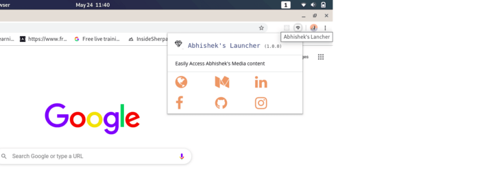
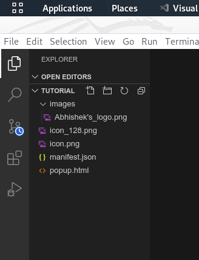
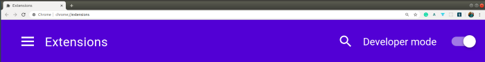
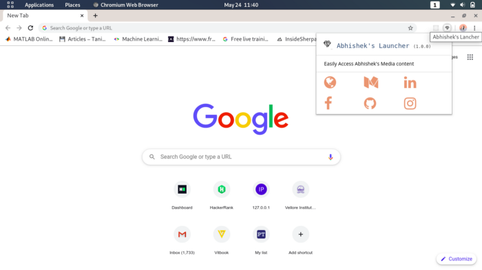

Inthis article, I would be briefing you about the Chrome Extension and how can you develop your browser extension.

So, let’s get started with some basics formal 
definition.

## What is a browser extension?
*A browser extension is a small software module for customizing a web browser. Browsers typically allow a variety of extensions, including user interface modifications, ad blocking, and cookie management. Browser plug-ins are a separate type of module.*

#### Well, Abhishek that all went above my head, can’t you tell me that in simple words…?`

Okay, In simple words, we can say that a browser extension is a computer program that extends the functionality of the browser, and can make your work easier by introducing new features.

--- 

## So, What’s next..?

Now since you are familiar with the browser extension and how I can be useful for us in various test cases. Now let’s move the next part.

Have you ever thought of making one for yourself?

#### What!!, dude is that really possible, can I also have my personal extension!!, it would be really great!

Yes, you can have your personal browser extension. Google Chrome allows you to create your own extension, test it, and publish it. Your personal extension can as simple as a button that redirects you, or it can also be a complex and advanced extension(it’s all up to you).

But for beginners my advice would be that it doesn’t need to be some new groundbreaking idea or complex extension, you can just do this for fun.

#### But Abhishek, I don’t have enough knowledge of how all this work, it seems to be complicated, and I doubt whether I have enough skills or not :(

Don’t worry, you should just be familiar with basic HTML/CSS syntax and that would be enough.

#### Ahh, I like this point of yours Abhishek, go on…

## What are we going to build?

For the purpose of this tutorial, I am going to build a simple Profile Manager which launches all your profiles through a single click.

 
 

I find this project user-friendly and simple for `understanding how extensions` are made, and the basic file structure

The `Link of the Github repository` will be provided at the end of the article, you can `fork my Github repository` and customize the same.

#### Yes yess Abhishek, Go ahead!!

---

## Getting Started

This is the basic file structure of our project is shown below…

 
 

#### What is this Abhishek!!, I didn’t get it, what are all this manifest.js and all I don’t even know js.

Don’t be scared at the first look, I’ll be explaining each of them in detail.
* **icon.png**: (19x19 pixels) for the icon displayed at the extension bar
* **icon_128.png**: (128x128 pixels) for the icon displayed at the chrome store beside your extension name
* **logo Icon**: Add a logo image(50x50 pixels) under a folder named ‘images’ for the logo displayed at your extension, here it is named as “Abhishek’s_logo.png”
* **popup.html**: this decides the UI interface of how your extension appears ( refer the popup.html in GitHub code for better understanding)
* **manifest.json**: This is the mandatory file for chrome extensions including the name, manifest version, browser actions, permissions, etc. This file usually tells the extension of what to do and where to get resources to achieve a particular task. In simple words, It handles all the configuration of your extension.

 
 

## Congratulations!, you have successfully completed the coding part of the Extension

#### That’s it!!, It was so extremely simple, but what about publishing it.

## Let’s move towards the publishing part

I’ll the explaining the publishing part in form of simple steps so that you guys can easily follow along.

* **Step — 1**: Launch the Google Chrome Browser

* **Step — 2**: In the URL section, simply type: chrome://extensions/

* **Step — 3**: Make sure the developer option is checked or toggled to the right

 
 

* **Step — 4**: Now, It’s time to upload your files. Click on load unpack and choose the folder with all files.

* **Step — 5**: Activate the extension and you can now be able to see it in the top right corner of your browser.

 
 

# Congratulations!, you have successfully published your Extension.

If you want to publish in the Chrome store, carry forward with the following step by step guide: https://developer.chrome.com/webstore/publish

## Conclusion

We did it! If you followed along with me through this whole tutorial, you should have a really good feel for Chrome extensions now. To summarize, we have divided the article into two parts. The first part deal with the basic files required, their Coding and configuration, and the second one deals with publishing the Extension.
This article should have given you a good introduction to web browser extensions. There is much more to learn and improve, but I hope you feel confident delving in and playing around with extensions yourself now.

[`View Source on GitHub`](https://github.com/abhishek2x/Profile-Launcher-Extension)

Please let me know if anything was unclear, or if there’s anything else you’d like to see in this or a subsequent article. Feel free to reach out to me anytime if you want to discuss something. I would be more than happy if you send your feedback, suggestions.

Link to published article: [`Medium`](https://medium.com/code-to-express/build-a-chrome-extension-in-less-than-20-mins-910c85d5135c)

### Thanks a lot for reading till end. You can contact me in case if you need any assistance:
* **Web:** https://portfolio.abhisheksrivastava.me/
* **Instagram:** https://www.instagram.com/theprogrammedenthusiast/
* **LinkedIn:** https://www.linkedin.com/in/abhishek-srivastava-49482a190/
* **Github:** https://github.com/abhishek2x
* **Email:** abhisheksrivastavabbn@gmail.com
