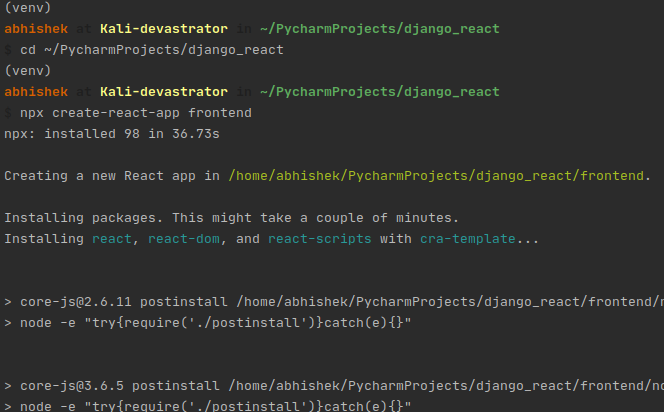
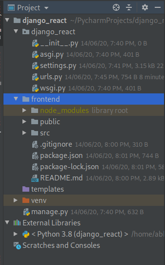
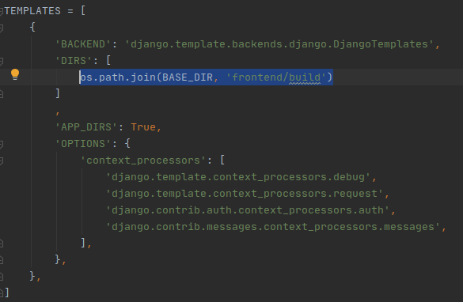
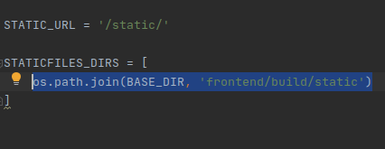
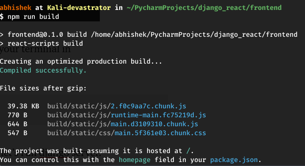
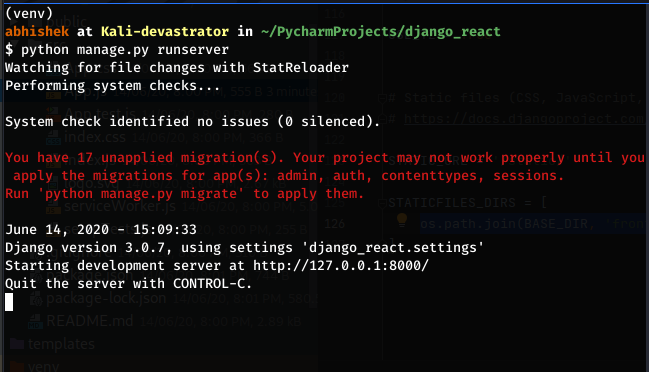
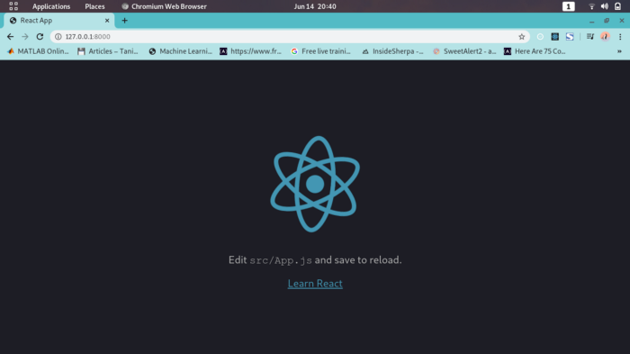
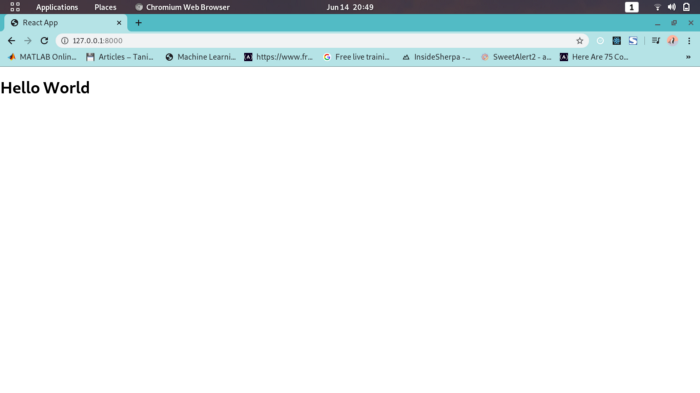

In this short, yet comprehensive article, I’ll walk you through the complete process of Integrating your Django back-end application with React front-end.


Hopefully, it helps you understand powerful inbuilt features of Django, as it’s difficult to wrap your head around when you’re first starting. Source code will be provides towards the end of the article.

## PREREQUISITES:-

* Familiarity with `Django` and it’s file structure.
* Basics of `React`.

## GOAL:-

Create a `Hello-World App` to understand the linking process of Django and React.

#### `Note`: Since there are many ways to do the same task, In this article I will be discussing the one which I find most suitable and handy.

So, Let’s dive into it!

---

## Initial Setup

I assume you have Django installed . You can check the installed version of Django by running the following command in a terminal prompt (indicated by the $ prefix):

```bash
python -m django --version
```

#### Create a project

```bash
django-admin startproject django_react

```

#### Currently, this is how my file directory looks like:


<br/>
<br/>

Lets me explain the directories and files of the above image:-

`django_react`: This is our main Django project.
`templates`: This is the default location of our templates(although this will be changed as we proceed).
`venv`: This is the virtual environment we are working in.

The rest are basic Django files, I consider you would be familiar with that.

---

Now, its time to pull up our React app.
Run the following command in a terminal prompt (indicated by the $ prefix):


```bash
cd ~/PycharmProjects/django_react
```
This command will make sure that you are in the correct directory(In this illustration I’ll be using pycharm).

Create a React App named `‘frontend’`

```bash
cd ~/PycharmProjects/django_react
```



<br/>
<br/>

It would take some time to fetch all the file, once you are done, we are good to go.




<br/>
<br/>

Here you will notice that we got an app named front-end which contains all our react files.


---

## Linking Part


What we need to do is to connect two things: —

* Connect our templates.
* Connect React static assets.

First, we are going to edit some configurations in our settings.py file in django_react directory.

Adding the path in `TEMPLATE` list


```python
os.path.join(BASE_DIR, 'frontend/build')
```



<br/>
<br/>

Now edit urls.py file in django_react directory.

```python
from django.views.generic import TemplateView
```

Making a URL pattern for our frontend/public/index.html file


```python
path('', TemplateView.as_view(template_name='index.html')),
```

Till now we have connected out templates, now it’s time to handle out `static assests`.

Down in out settings.py file make for following changes in `STATICFILES_DIRS`


```python
os.path.join(BASE_DIR, 'frontend/build/static')
```



<br/>
<br/>

Now one last build command, so fire up your terminal in `~/django_react/frontend` directory

```node
npm run build
```      



<br/>
<br/>

#### Now, Everything is configured perfectly, let’s run the Django server.

python manage.py runserver



<br/>
<br/>

Go to `http://127.0.0.1:8000/`




<br/>
<br/>

# Congratulations!!, you have perfectly configured everything.

*In case you didn’t see this screen, I would recommend you to go back and check if in case you have missed anything.*

Let’s convert this into a `Hello-World` App

Edit `App.js` file in `frontend/src/App.css`

```js
import React from 'react';
import logo from './logo.svg';

function App() {
  return (
    <div className="App">
        <h1>Hello World</h1>
    </div>
  );
}

export default App;
```

Notice that I removed import `‘./App.css’`; this from App.js.

**Debugging tip**: In case you didn’t find the below page, you can execute run npm build command once again and then launch the server




<br/>
<br/>

# And this is it!!, You accomplished your goal. Many Many Congratulations!

## Conclusion

There you have it. A complete process of linking your Django App with React App.

Source Code → https://github.com/abhishek2x/django_react


I hope this tutorial helped you understand the workflow of Django + React. Using this loosely-coupled pattern can add a lot of boilerplate and abstraction to an application, but it’s also a predictable, familiar pattern that is commonly used across many frameworks, and an important concept to know as a developer.

### Thanks a lot for reading till end. You can contact me in case if you need any assistance:

**Web:** https://portfolio.abhisheksrivastava.me/

**Instagram:** https://www.instagram.com/theprogrammedenthusiast/

**LinkedIn:** https://www.linkedin.com/in/abhishek-srivastava-49482a190/

**Github:** https://github.com/abhishek2x

**Email:** abhisheksrivastavabbn@gmail.com


Link to published article: [`Medium`](https://medium.com/dev-genius/integrating-django-with-react-ff596e764bdc)