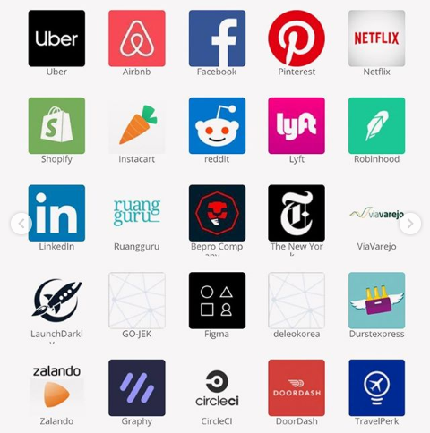
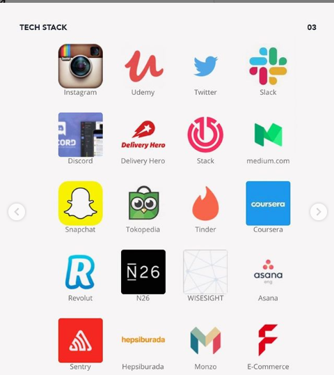
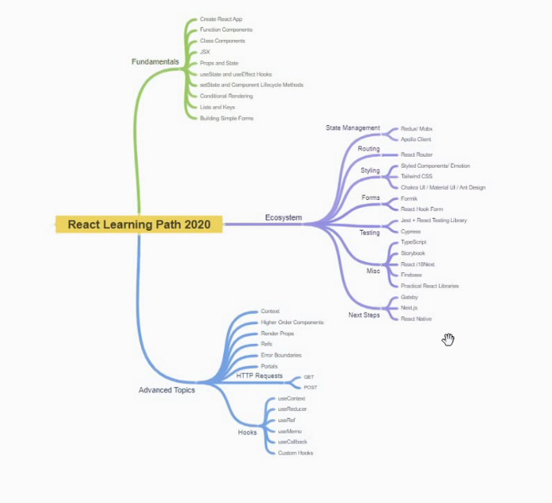
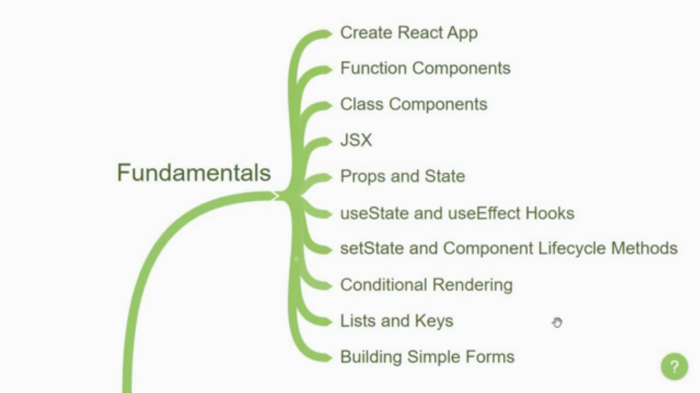
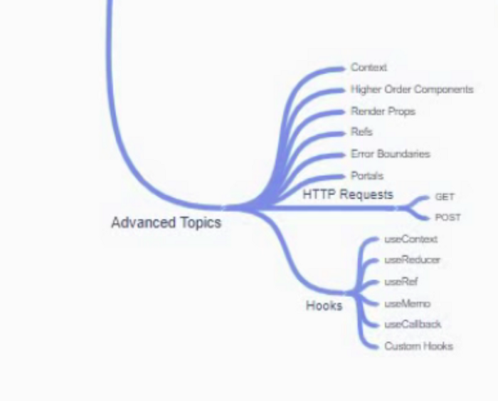
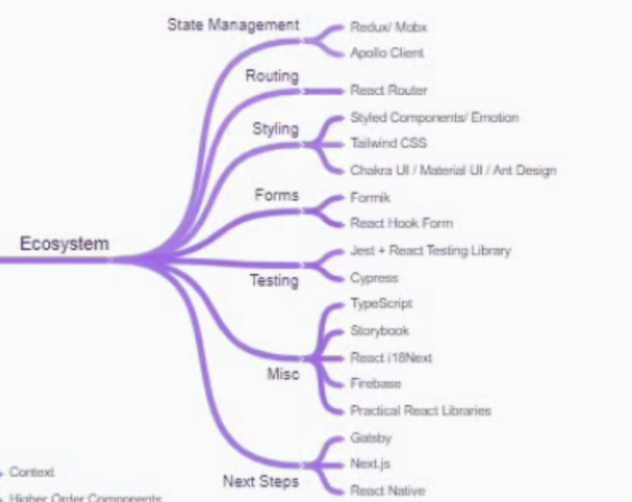

## A theoretical Introduction to React

*React is a JavaScript library that aims to simplify the development of visual interfaces. Developed at Facebook and released to the world in 2013, it drives some of the most widely used code in the world, powering many software companies.*

## Companies Using React

 
 

Now, since you have some idea about React and aware of its high-scale implementation, it’s time to discuss the pre-requisites for learning React.

---

## Top Skills you must know before you learn React
* HTML and CSS
* JSX (JavaScript and XML) and Babel
* Fundamentals of JavaScript and ES6
* Package Manager (Node + Npm)

### *Don’t let perfectionism become an excuse for never getting started.*

---

## Road-Map

*This will serve as a guideline to anyone who is learning React.*

 
 

I have broken down the paths in three sections:-

* Fundamentals of React.
* Advanced topics in React.
* The Ecosystem.

## PART-A: THE FUNDAMENTALS

 
 

### Create-React-App

It is an officially supported way to create a simple page react application with no configuration. This means that you can create a react application to mess around the code by executing a few lines in a matter of minutes. Once you have a create-react-app you then get started with some technical concepts in react.

### Functional and Class Component

React application is made up of some reusable bits of code called Component. In React, you can create a function component or a class component.

### JSX

In React, when you create components you’ll soon get confused by the idea of writing HTML like code inside JavaScript this is what is termed as JSX. It is a syntax extension to JavaScript. With JSX you pretty much describe what the UI should look like.

### Props

Props which stands for properties are just arbitrary inputs for a component which play a major part in making the component reusable. However, props are read-only the component can never modify its own props this is the point in time where you start learning about State.

### State

State allows React components to change their output over time which in turn we render the UI. Once you have a good grasp on props and state you need to understand how to modify state along with that.

It is also important to understand what causes a component to re-render and how to hook into those methods so you will learn about two basic hooks.

### useState and useEffect hooks

You will learn these two basic hooks when dealing with the functional component.

### setState and Component Lifecycle Methods

You will learn these two basic hooks when dealing with a Class component.

### Conditional Rendering

Now that can use the state to change values within the component, we want to leverage that value and conditionally render the UI. So your next step is to understand the different ways to conditionally render elements in the JSX.

### Lists and Keys

After this, you will learn how to render a list of items and the key prop which is required for lists.

### Building Simple Forms

Finally, you will understand how to build simple forms like login and registration by understanding the concept of controlled components in react.

*Progressing through the topic in this order, you will have a really good understanding of the fundamentals of React.*

## PART-B: ADVANCED TOPICS IN REACT

 
 

### Context

React’s context allows you to share information to any component, by storing it in a central place and allowing access to any component that requests it (usually you are only able to pass data from parent to child via props).

### Higher-Order Component and Render Prop

You will then come across the higher-order Component and Render prop patterns which are patterns to share logic across components.

### Refs and Error Binding

Ref is a feature of React which allows us to access the DOM. Error Binding allows us to catch errors and have graceful UI feedback if there are any exceptions.

### Portals

React portals allow us to render UI outside the root element of our react application.

### HTTP Requests

Once you understand these topics, you should focus on making HTTP requests from your React Application. You can either use fetch or a package like Axios to understand how to make get and post requests at the minimum.

### Hooks

Finally, you can concentrate on some of the other hooks like:-

* useContext
* useReducer
* useRef
* useMemo
* useCallback
* Custom hooks

**Implementing Custom Hook allows you to share logic across function components**

*If you have gone through this list of topics, then you’re in a great position*

## PART-C: THE ECOSYSTEM

 
 

The Ecosystem is a list of other packages that play well with react and help you create awesome react applications.

### State Management

Learning about state management you can either learn redux or mob acts and Apollo client if you're using Graph QL. This is another area on which you might be questioned in your interview.

### Routing

Next, you’ll be learning about routing, how to deliver different components when the user visits different URL’s in the browser. The go-to package is react-router.

### Styling

The next thing to learning is Styling you React app. You can get started with CSS and JS solutions like style components or emotion that are popular or you can also go the route of tailwind CSS which is rising in its popularity and if you want to quickly get up and running you can use UI libraries like chakra UI material UI and design and so on.

### Forms

If your application has complex forms to deal with, you might want to learn formik or React Hook form.

### Testing

When you want to learn testing, you will learn React testing library for unit testing and Cypress for end-to-end testing.

### Miscellaneous

**TypeScript** — this will let you add types to your react apps which will greatly reduce bugs in your code and the auto-completion will make your developer experience much better.
**Storybook** — if you wish to document your components this is the package for you. I feel that you should be aware of some of the features that storybook offers, they would help you a lot.
**React i18Next** — if you want internationalization in your application, you can experiment with React i18Next.
**Firebase** — if you want to add authentication perhaps use a new SQL type database and also host your react application, you can go with Firebase it is really easy to get started with the SDK and this will also avoid you from having to create your own Node+ MongoDB back-end.
**Practical React Libraries** — you might want to focus on a few practical React libraries that will be of use in most of your react applications, for example, adding modal’s tooltips, charts and so on.

# *If you have come to this far, Congratulations! You know your React.*

## Next Steps

If you want to broaden your horizon, there are few paths you could take a detour into.

* `Gatsby` — For static site generation.
* `Next.js` — For service site rendered apps.
* `React-Native` — For diving into the World of Native React Apps.

---

## Conclusion

This article should have given you a good introduction to web browser extensions. There is much more to learn and improve, but I hope you feel confident delving in and playing around with extensions yourself now.

Please let me know if anything was unclear, or if there’s anything else you’d like to see in this or a subsequent article. Feel free to reach out to me anytime if you want to discuss something. I would be more than happy if you send your feedback, suggestions.

**Web:** https://portfolio.abhisheksrivastava.me/

**Instagram:** https://www.instagram.com/theprogrammedenthusiast/

**LinkedIn:** https://www.linkedin.com/in/abhishek-srivastava-49482a190/

**Github:** https://github.com/abhishek2x

**Email:** abhisheksrivastavabbn@gmail.com

Link to published article: [`Medium`](https://codeburst.io/a-practical-road-map-for-react-development-aad87afdd5d0)