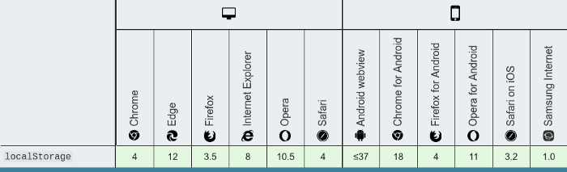

#### This article is divided into of two parts:
* `Part-1`: Theoretical Explanation
* `Part-2`: Practical Implementation

---

## A Theoretical Explanation for localStorage

### What is a localStorage?

`localStorage` is a type of web storage that allows JavaScript sites and apps to store and access data right in the browser with no expiration date. This means the data stored in the browser will persist even after the browser window has been closed. The stored data is saved across browser sessions.

*Data in a localStorage object created in a "private browsing" or "incognito" session is cleared when the last "private" tab is closed.*

### Methods and Properties provided by Storage Object

* **setItem(key, value)** – store key/value pair.
* **getItem(key)** – get the value by key.
* **removeItem(key)** – remove the key with its value.
* **clear()** – delete everything.
* **key(index)** – get the key on a given position.
* **length** – the number of stored items.

#### Don’t be confused, I’ll be covering each of them individually with detailed explanation.

### First: setItem()

Just as the name implies, this method allows you to store values in the localStorage object.

It takes two parameters: a key and a value. The key can be referenced later to fetch the value attached to it.

Where `name` is the key and `Abhishek Srivastava` is the value. Also note that localStorage can only store strings.

To store arrays or objects, you would have to convert them to strings.

To do this, we use the `JSON.stringify()` method before passing to `setItem()`.

### Second: getItem()

The `getItem()` method allows you to access the data stored in the browser’s localStorage object.

It accepts only one parameter which is the key and returns the `value` as a string.

To use this value, you would have to convert it back to an object.
To do this, we make use of the `JSON.parse()` method, which converts a JSON string into a JavaScript object.

### Third: removeItem()

When passed a key name, the `removeItem()` method will remove that key from the storage if it exists. If there is no item associated with the given key, this method will do nothing.

### Forth: clear()

This method, when invoked, clears the entire storage of all records for that domain. It does not receive any parameters.

### Fifth: key()

The `key` method comes in handy in situations where you need to loop through keys and allows you to pass a number or index to `localStorage` to retrieve the name of the key.

### Sixth: length

The length property returns the number of items stored in the browsers Storage Object, for this particular domain.

The length property belongs to the Storage Object, which can be either a localStorage object or a `sessionStorrage` object.

*That’s it, now you would have good understanding of methods and properties provided by the Storage Object*

---

## Browser compatibility

 
 
---

## localStorage limitations

As easy as it is to use localStorage, it is also easy to misuse it. The following are limitations, and also ways to NOT use localStorage:

* Do not store sensitive user information in localStorage

* It is not a substitute for a `server based database` as information is only stored on the browser

* localStorage is limited to `5MB across all major browsers`

* localStorage is `quite insecure` as it has no form of data protection and can be accessed by any code on your web page

* localStorage is `synchronous`, meaning each operation called would only execute one after the other

With these, we have been armed with the power of localStorage in our web applications.

# *If you have come to this far, Congratulations! You have good theoretical understanding of localStorage.*

---

#### Well, that’s it for today :(

I am sorry buddy, I really don’t want to leave it in between, but currently, I am a bit short on time, plus, if I write both theoretical explanation and the practical implementation in a single blog, it will be too lengthy, and lengthy blogs become boring :/

So yeah, that’s it for today, I will be back with the Implementation part next weekend and yes I can assure you that the second part is going to be much more interesting and we going to build something really cool, till then, enjoy, and thanks for reading till the end.

#### Happy Coding!
*Feel free to reach out to me anytime if you want to discuss something. I would be more than happy if you send your feedback, suggestions.*

**Web:** https://portfolio.abhisheksrivastava.me/

**Instagram:** https://www.instagram.com/theprogrammedenthusiast/

**LinkedIn:** https://www.linkedin.com/in/abhishek-srivastava-49482a190/

**Github:** https://github.com/abhishek2x

**Email:** abhisheksrivastavabbn@gmail.com

Link to published article: [`Medium`](https://codeburst.io/a-practical-road-map-for-react-development-aad87afdd5d0)