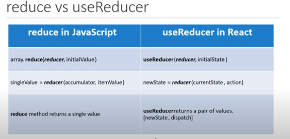
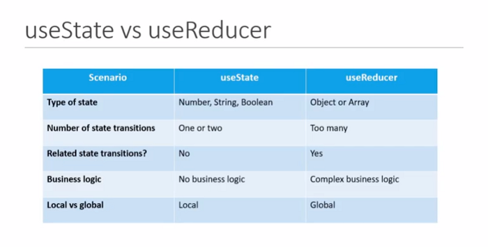

## Starting with the background details

React is a JavaScript library that aims to simplify the development of visual interfaces. Developed at Facebook and released to the world in 2013, it drives some of the most widely used code in the world, powering many software companies.

---

## A Big Misconception

**React is a JavaScript “library”. It is not exactly a “framework”**. It is not a complete solution and you will often need to use more libraries with React to form any solution. React does not assume anything about the other parts in any solution.

Frameworks serve a great purpose, especially for young teams and startups. When working with a framework, many smart design decisions are already made for you, which gives you a clear path to focus on writing good application-level logic. However, frameworks come with some disadvantages. For experienced developers working on large code bases, these disadvantages are sometimes a deal breaker.

Frameworks are not flexible, although some claim to be. A framework usually wants you to code everything a certain way. If you try to deviate from that way, the framework usually ends up fighting you about it. Frameworks are also usually large and full of features. If you need to use only a small piece of them, you have to include the whole thing anyway. Admittedly, this point is changing today but it is still not ideal.

---

## Let’s Get Started with the Fundamentals

### Snippet

For VS Code users, here are some useful snippets:

**Extension Name :** ES7 React/Redux/GraphQL/React-Native snippets

*rce* -> Creates a Class based component
*rfce* -> Creates a Functional component
*rconst* -> Creates the constructor for the class

#### There are a lot other extension out there, the these are the one which is used most frequently.

---

## Lifecycle Methods


### Mounting

When an instance of component is created or inserted into the DOM
* constructor
* static getDerivedStateFromProps
* render
* componentDidMount

### Upgrading

When a component is being re-rendered as a result of change to either it’s props or state.

* static shouldComponentUpdate
* shouldComponentMount
* render
* getSnapBeforeUpdate
* componentDidUpdate

### Unmounting

When the component is being removed from the DOM

* componentWillUnmount

### Error handling

When there is an error during rendering, in a lifecycle method, or in a constructor of a child component

* static getDerivedStateFromError
* componentDidCatch

### Fragments

A common pattern in React is for a component to return multiple elements. Fragments let you group a list of children without adding extra nodes to the DO

### Pure Component

Pure component only re-renders the class component when there is a shallow comparison of props and state. This results in a performance improvement. It works only with class based components.

### Memo

It is a higher order component. What pure component is to class based component ,memo is to functional components

### Refs

Refs makes it possible to access DOM nodes in React. There are two valid approaches are:-

* React.createRef() method
* Callback method.

Refs can be used with both functional and class component. Refs can also be passed from a parent component to the child component.


**Forwarding Ref:** Refs can also be forwarded from the parent compoonent to native input component using `forwardRef(native component, ref)` method. Basically the child component receives the ref from the parent component and attaches it to the native input element.

### Portals

*React portals provide a way to render children into a Dom node that exists outside the `DOM hierarchy` of the parent component*. It provides the ability the break out of the DOM Tree. It uses a function `ReactDOM.createPortal(JSX, id)`.Portal behave like a React child. We need of Portals to deal with child-parent CSS

### Error Boundary

*Error Boundary are React Component that catch JavaScript errors in the child component tree, log these errors, and display the fallback UI*. A Class Component that implements either one or both of the lifecycle methods 

`getDerivedStateFromError` and `componentDidCatch` becomes an error boundary.

**getDerivedStateFromError**: This is a static method that is used to render the fallback UI after an error is thrown.

**componentDidCatch**: This is a method which is used to log the error message.

Error Boundary catch error during rendering in lifecycle methods and in the constructor of the whole tree below them, however, they do not catch errors inside event handlers


### Higher Order Component — HOC

A pattern where a *function takes a component as an argument and returns a new enhanced component*. It shares common properties within the components without having to repeat the code.

**const newComponent = higherOrderComponent( originalComponent )**

**Non-technical example: const Ironman = withSuit( TonyStark )**

It is a nice little pattern that can be used to share common functionality between React Components.


### Render Props

The term `“render prop”` refers to a technique for *sharing code* between React Component using a **prop whose value is a function**.

### React Context

Context provide a way to pass data through the component tree without having to pass props down manually at each level.

It mainly includes three steps:

* **Create a context** — Using createContext() method and export provider and consumer component as well.
* **Provide a context value** — At top level, include provider component and pass the value using value attribute.
* **Consume the context value** — Use consumer component and pass a function as a child

---

## Diving into Hooks


<br/>
<br/>

**Hooks is a new feature in React 16.8 which allows you to use React features without having to write a class**. Conceptually, React components have always been closer to functions. Hooks embrace functions, but without sacrificing the practical spirit of React. Hooks provide access to imperative escape hatches and don’t require you to learn complex functional or reactive programming techniques.*

## Why Hooks?


#### Problem-1

Understanding how **this** keyword works in JavaScript
Remember to bind event handlers in class Components
Classes don’t minify very well and make hot reloading very unreliable.

#### Problem-2

There is no particular way to reuse stateful compomnent Logic
HOC and render prop pattern do address this problem but it makes the code harder to follow.
There is need to share stateful logic in a better way

#### Problem-3

When creating component for complex scenarios, the related code is not organised in one place

---

## Rules of Hooks

*Points to keep in mind when dealing with hooks*

* **Only call hooks from React functions**. Don’t call hooks inside any regular JavaScript function.
* **Only call hooks at the top level**. Don’t call hooks inside loop, conditions or nested functions.

## Types of Hooks

### 1 — useState

* useState hook lets you add state in functional component
* In classes the state is always an object
* With useState hook, state does not have to be an object
* New state depends on the previous state values

=> **useEffect**

The Effect Hook lets you perform side effect in functional Component
It is a close replacement for componentDidMount, componentDidUpdate and ComponentWillUnmount

=> **useContext**

Context provide a way to pass data through the component tree without having to pass props down manually at every level

=> **useReducer**

It is a hook used for State Management. It is an alternative for useState. It is a more primitive hook than useState.




<br/>
<br/>



<br/>
<br/>

=> **useCallback**

Is is a hook that will return a memorized version of the callback function that only changes if one of the dependencies has changed.
It is useful when passing callback to optimize child components that rely on reference equality to prevent the unnecessary re-renders.
*{ reference equality is checking if the functions are equal or not. }*

=> **useMemo**

You may rely on useMemo as a performance optimization, not as a semantic guarantee. In the future, React may choose to “forget” some previously memorized values and recalculate them on next render, e.g. to free memory for off screen components.

#### Difference between useCallback and useMemo

useCallback caches the provided function instance itself, whereas useMemo invokes the provided function and catches its result.
So if you need to cache a function use the useCallback hook, and if you need to cache the results of a function use the useMemo hook.

=> **useRef**

Commonly used to focus the input fields.
Altogether, it can be used to create a generic container which can hold a mutable value similar to instance properties of a class components.
This generic container does not cause re-renders when the data it stores changes.
At the same time it also remembers the stored data in after other state variable cause a re-render of this component.


### The above hooks are used in most of the cases, apart from these there are three more hooks:-

* useImperitiveHandle
* useLayoutEffect

---

## Bonus Topic — Data Fetching

`Axios` is a lightweight HTTP client based on the HTTP service and is similar to the native JavaScript Fetch API. Axios is promise-based, which gives you the ability to take advantage of JavaScript’s async and await for more readable asynchronous code.

`npm install axios`

### Using Axios and useEffect to fetch data in React

```js
import React, { useState, useEffect } from "react";
import Axios from "axios";

function DataFetching() {
  const [post, setPost] = useState({});
  const [id, setId] = useState(1);
  const [idFromButtomClick, setIdFromButtomClick] = useState(1);

  const handleClick = () => {
    setIdFromButtomClick(id);
  };

  useEffect(() => {
    Axios.get(`https://jsonplaceholder.typicode.com/posts/${id}`)
      .then((res) => {
        console.log(res);
        setPost(res.data);
      })
      .catch((err) => {
        console.log(err);
      });
  }, [idFromButtomClick]);

  return (
    <div>
      <input type="text" value={id} onChange={(e) => setId(e.target.value)} />
      <br />
      <button type="buttton" onClick={handleClick}>
        Fetch Post
      </button>
      {/* <ul>
        {posts.map((post) => (
          <li key={post.id}>{post.title}</li>
        ))}
      </ul> */}
      {post.title}
    </div>
  );
}

export default DataFetching;
```

### Using Axios and useReducer to fetch data in React

```js
import React, { useReducer, useEffect } from "react";
import axios from "axios";

const initialState = {
  loading: true,
  error: "",
  post: {},
};

const reducer = (state, action) => {
  switch (action.type) {
    case "FETCH_SUCCESS":
      return {
        loading: false,
        post: action.payload,
        error: "",
      };
    case "FETCH_ERROR":
      return {
        loading: false,
        post: {},
        error: "SOMETHING WENT WRONG",
      };
    default:
      return state;
  }
};

function DataFetching2() {
  const [state, dispatch] = useReducer(reducer, initialState);

  useEffect(() => {
    axios
      .get(`https://jsonplaceholder.typicode.com/posts/1`)
      .then((res) => {
        dispatch({ type: "FETCH_SUCCESS", payload: res.data });
      })
      .catch((err) => {
        dispatch({ type: "FETCH_ERROR" });
      });
  }, []);

  return (
    <div>
      {state.laoding ? "Loading..." : state.post.title}
      {state.error ? state.error : null}
    </div>
  );
}

export default DataFetching2;

```

---

## Conclusion

This article should have given you a good introduction to to the Key concepts of React Js. There is much more to learn and improve, but I hope you feel confident delving in and playing around with react yourself now.

If you are confused at some point and need a roadmap to study React, then you can refer the below mentioned article.


Please let me know if anything was unclear, or if there’s anything else you’d like to see in this or a subsequent article. Feel free to reach out to me anytime if you want to discuss something. I would be more than happy if you send your feedback, suggestions.

#### Thanks a lot for reading till the end. You can contact me in case if you need any assistance:


**Web:** https://portfolio.abhisheksrivastava.me/

**Instagram:** https://www.instagram.com/theprogrammedenthusiast/

**LinkedIn:** https://www.linkedin.com/in/abhishek-srivastava-49482a190/

**Github:** https://github.com/abhishek2x

**Email:** abhisheksrivastavabbn@gmail.com


Link to published article: [`Medium`](https://medium.com/swlh/a-complete-guide-to-localstorage-in-javascript-part-2-115ecae5e00c)