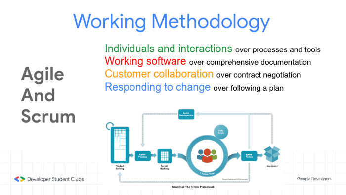
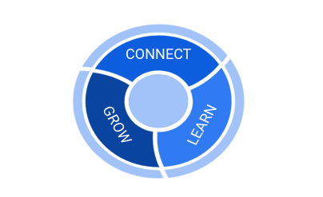

## What are Developer Student Clubs?

*Developer Student Clubs are university based community groups for students interested in Google developer technologies. Students from all undergraduate or graduate programs with an interest in growing as a developer are welcome. By joining a DSC, students grow their knowledge in a peer-to-peer learning environment and build solutions for local businesses and their community.*

## Developer Student Clubs, Vellore Institute of Technology, Bhopal

`DSC, Vellore Institute of Technology, Bhopal`

Developer Student Clubs is an **initiative of Google Developers**. Google collaborates with *DSC Leads* once a year who are pursuing an undergraduate or graduate university degree and supports them as they start and grow their on-campus community.

The DSC program is a **grassroots channel** through which Google provides development skills, mobile and web development skills for students, towards employability. DSC activities are targeted at University students and others including faculty members who want to learn development skills & work to solve real-life problems.

We at DSC — VIT Bhopal look forward to form a community where we are able to convert our knowledge into real time application , help each student to develop in different fields of technology and make use of our knowledge to build something that helps local businesses around us as well as their community.

## Our goal is to Impact students, and empower them to impact their communities through technology and provide native app and web development skills for students to help them work towards employability.

 
 

### Our Vision is to help impact students bridge the gap between theory and practice and leave a legacy of impact.

Developer Students Club opts to shape student developers for a better future. It is open to any student, ranging from novice developers who are new to technical domain, to advanced developers who want to expand their skills set. It is intended to be a space for students to learn and collaborate as they solve problems.

At the Developer Student Club, we believe in **three pillars of excellence** which makes us unique and helps us stand out. The three pillars are **Connect, Learn and Grow.**

 
 

## Connect
Students get to meet various other students who are interested in developing technologies. All are welcome, including those with diverse backgrounds and different majors. Students gain relevant industry experience by solving problems for local organizations with technology-based solutions.
## Learn
Students learn about a wide range of technical topics where new skills are gained through hands-on workshops, expert training and project building activities. We help students to get inspiration and become world-class developers and changemakers from sharing others’ success stories.
## Grow
We expect students to apply their new learnings and connections to build great solutions for local problems. Advance their skills, career and network and give back to their community by helping others learn as well. We provide them with a platform to showcase their prototypes and solutions to their local community and industry leaders.

 
 

## Technology that Excites Us:

* Android
* Machine Learning / AI
* UI / UX
* Web Development
* Cyber Security
* Open Source Projects
* AR / VR
* Assistant / Actions on Google
* Firebase
* Flutter
* Google Cloud Platform
* Gaming Technology

## Conclusion

Developer Student Club is in no way restricted to VIT Bhopal, students will get the opportunity to learn and collaborate with all the DSC’s that are established around the globe. **Only things required from students end is their interest in technology and willingness of learning**. We are here to create an impact and provide a feeling to fellow students developers that they are part of something huge!

In a nutshell, the Developer Students Club focuses on bringing the best out of students who are always eager to learn something new and make them ready for today’s industry. We, as engineers, have a responsibility towards the development of society. **Being the community Lead of Developer Student Club I ensure that everyone gets the guidance to fulfill their dreams for the betterment of tomorrow.**

 
 

## Developer Student Clubs, Vellore Institute of Technology, Bhopal Links:

**Website**: https://dsc.community.dev/vellore-institute-of-technology-bhopal/

**Instagram**: https://www.instagram.com/dscvitbhopal/

**Linkedin** https://www.linkedin.com/company/dscvitbhopal

**Facebook**: https://www.facebook.com/Developer-Student-Club-VIT-Bhopal-111031300729975

**YouTube**: https://www.youtube.com/channel/UCVr5tPwyUH8rJd5yEhBd94w

**GitHub**: https://github.com/DSC-VIT-BHOPAL/

**Twitter**: https://twitter.com/dsc_vit

**Discord Invite**: https://discord.gg/R3fpety

**Email**: dscvitbhopal@gmail.com

#### Thanks a lot for reading till the end. You can contact me in case if you need any assistance:

**Web:** https://portfolio.abhisheksrivastava.me/

**Instagram:** https://www.instagram.com/theprogrammedenthusiast/

**LinkedIn:** https://www.linkedin.com/in/abhishek-srivastava-49482a190/

**Github:** https://github.com/abhishek2x

**Email:** abhisheksrivastavabbn@gmail.com

Link to published article: [`Medium`](https://medium.com/dsc-vit-bhopal/developer-student-clubs-d8dadd600b6d)