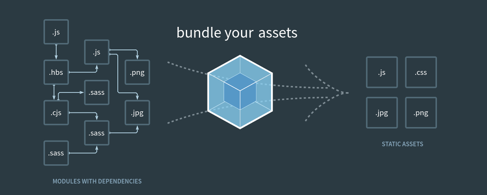
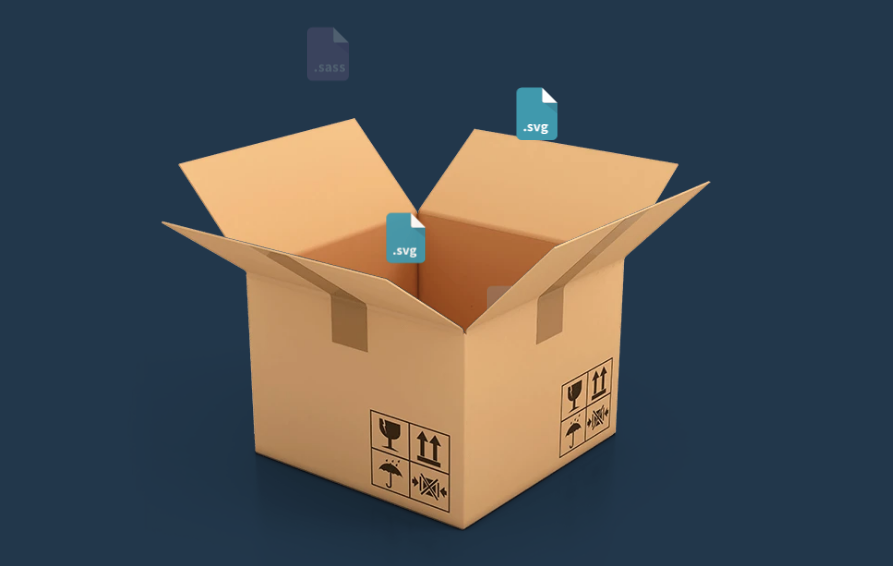
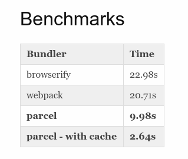
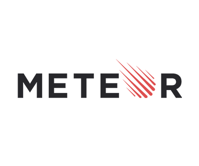
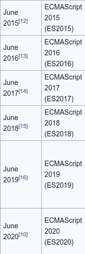
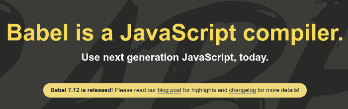
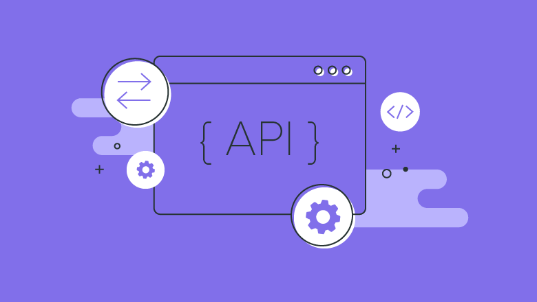
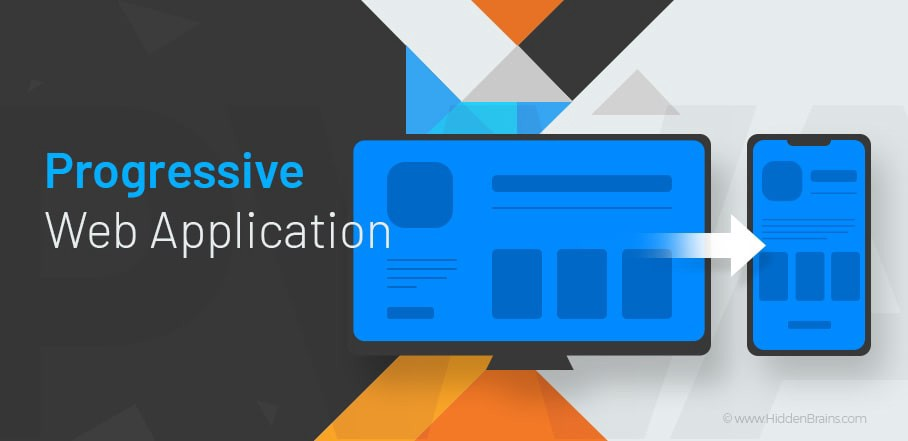
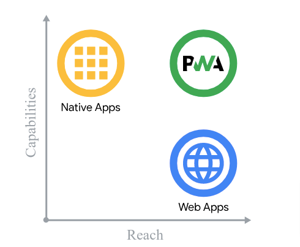

---

title: "What is </>"
path: blog/What-is-Web
tags: [reactjs]
cover: ./cover.png
date: 2021-02-08
excerpt: Covering Web Development technologies


---

At the beginning of 2020, I was an introverted student who attends university classes in the morning and is up all night in the hostel room and keeps exploring various domains of technologies.

## Introduction

Over the course of the past 2 years, I observed that there are a few things that trouble and concerns almost every beginner level Web developer.

Statistics depict that various web developers exit the Web development domain after learning HTML, CSS and JavaScript and shift into other domains like ML/AI, cybersecurity, Android development, etc.
After Observing closely, I listed down some of the basic tools and libraries that concerns developers as they are not even aware of how and why to use it.

_The most basic question I usually come across:_
_If I can develop a website using HTML, CSS and JS, why should I learn anything else…??_

### In this article, I’ll be discussing the following points:

- Webpack
- Parcel
- Meteor
- EcmaScript and Babel
- API
- Progressive Web App

So without any further ado, let’s get started…!


## Webpack

_Webpack_ is a _static module bundler_ for modern JavaScript applications.



While using a JavaScript library or frameworks like React or Angular, your website is distributed into many components, something is required to get all that together and make it readable by the web browser. This is were _webpack_ comes into the picture.

Simply, webpack is something that collects your assets, images, styles and scripts, process them and provide some different file. For our understanding, we can list this into these steps:

- Assembling your files
- Converting them into something your browser can recognise
- and spitting them out into actual files.


Here is a basic webpack configuration file:

```
const path = require('path');
  module.exports = {
    entry: './src/index.js',
    output: {
      path: path.resolve(__dirname, 'dist'),
      filename: 'bundle.js',
  },
};`

```

## Parcel

**Parcel** is _Blazing fast, zero-configuration_ web application bundler



The parcel is a web application bundler, differentiated by its developer experience. It offers blazing-fast performance utilizing multicore processing and requires zero configuration.

It is a simple bundler. It provides us with the following:

- Gets all of our HTML, CSS and JS file, combines them in the way we have imported or exported them.
- Minify the files.
- Allows us to use modern features.

_Yes, we can compare it to webpack with the configuration steps_




Based on a reasonably sized app, containing 1726 modules, 6.5M uncompressed. Built on a 2016 MacBook Pro with 4 physical cores.

<hr/>

## Meteor



**Meteor** is an _open-source framework_ for seamlessly building and deploying Web, Mobile, and Desktop applications in Javascript that has client-side, server-side and includes the database.

It is essentially a platform for building Node Js Application. It is extremely beneficial for building realtime applications.

### Cons for using Meteor

- Must use MongoDB as SQL support isn’t that good
- No official testing framework, it just keeps changing every two months or so
- Meteor isn’t opinionated at all, you can do pretty much what you want with the structure, which can be confusing


<hr/>

## ECMAScript and Babel

**ECMAScript (or ES)** is a general-purpose programming language. This is something JavaScript is based on. JavaScript actually comes from ECMAScript, this is where ES name comes from.

 

### Brief History

ES6 launched in 2016 (6th Edition). It brings a whole lot of new syntax and features to JavaScript.
But this is not it, in 2017 ES7 came out with some new features but not as large as ES6.
ES8 version was soon released the very next year. This includes things like async()…await()
The next is ES Next. It is a name which is given to the very next version of JavaScript 

### Bable

Some browsers support features of some ES version while other supports some other ES version. None of them supports features of all ES versions.

_So how are we going to utilize these features today?_
_*Bable is the Effective way to do this*_



## Resources

- <a href="https://es6.io/">https://es6.io/</a>
- <a href="https://github.com/lukehoban/es6features">https://github.com/lukehoban/es6features</a>
- <a href="https://babeljs.io/">https://babeljs.io/</a>
- <a href="https://babeljs.io/docs/en/learn/">https://babeljs.io/docs/en/learn/</a>


<hr/>


## API

An **application programming interface (API)**, is a computing interface that defines interactions between multiple software intermediaries


Let us take some general scenarios into account where API is used:

### Social Media Handle

Let us consider your photos on your Social media profile. How is it getting there?. Under the hood, there is an API that is fetching your data (Logged in user’s data) and displaying it before the user.

### Weather Application

To check whether at your location API is used. The client-side takes your co-ordinates and uses it while making an API call. Based on your co-ordinated, as a response to your API call, your whether information is returned.

There are countless examples to discuss regarding this, but I hope you get a general idea of what an API is.

We can say that it is something which is used to exchange data between the server and client side

<hr/>

## Progressive Web App



*Progressive Web Apps (PWA) are built and enhanced with modern APIs to deliver enhanced capabilities, reliability, and installability while reaching anyone, anywhere, on any device with a single codebase.*


A Progressive Web App is an application that builds and live on web but will function more and more like a native application
Progressive Web Apps are web applications that have been designed so they are capable, reliable, and installable

There are countless examples to discuss regarding this, but I hope you get a general idea of what an API is.



<hr/>

## Conclusion

This article should have given you a good introduction to the various tools and utilities of Web Development. There is much more to learn and improve, but I hope you feel confident delving in and playing around with a wide range of powerful utilities yourself now.

Please let me know if anything was unclear, or if there’s anything else you’d like to see in this or a subsequent article. Feel free to reach out to me anytime if you want to discuss something. I would be more than happy if you send your feedback, suggestions.

## _Happy Coding!_

### Thanks a lot for reading till end. You can contact me in case if you need any assistance:

**Web:** https://portfolio.abhisheksrivastava.me/

**Instagram:** https://www.instagram.com/theprogrammedenthusiast/

**LinkedIn:** https://www.linkedin.com/in/abhishek-srivastava-49482a190/2020-

**Github:** https://github.com/abhishek2x

**Email:** abhisheksrivastavabbn@gmail.com

Link to published article: [`Medium`](https://abhishek2x.medium.com/what-is-b58e52809672)
